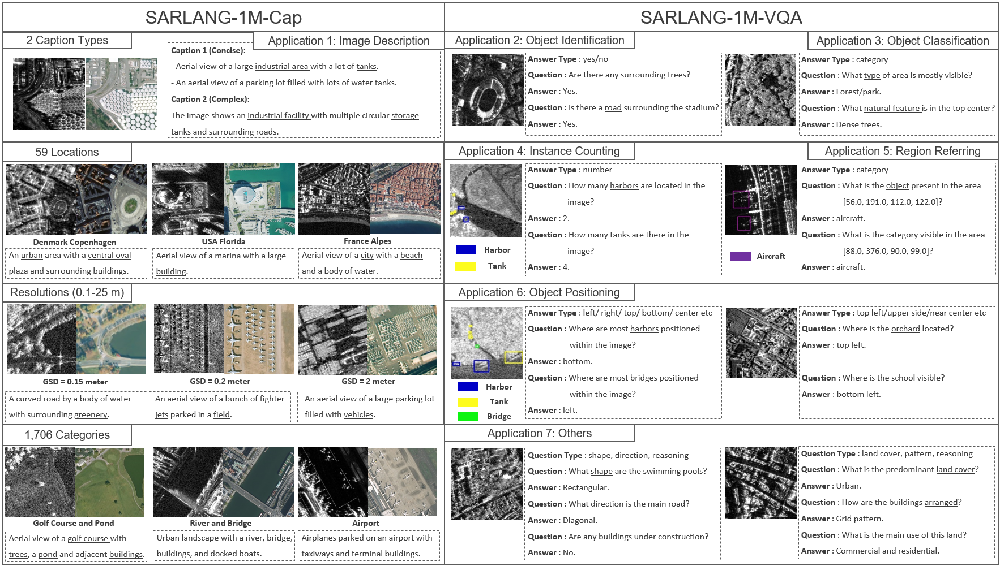
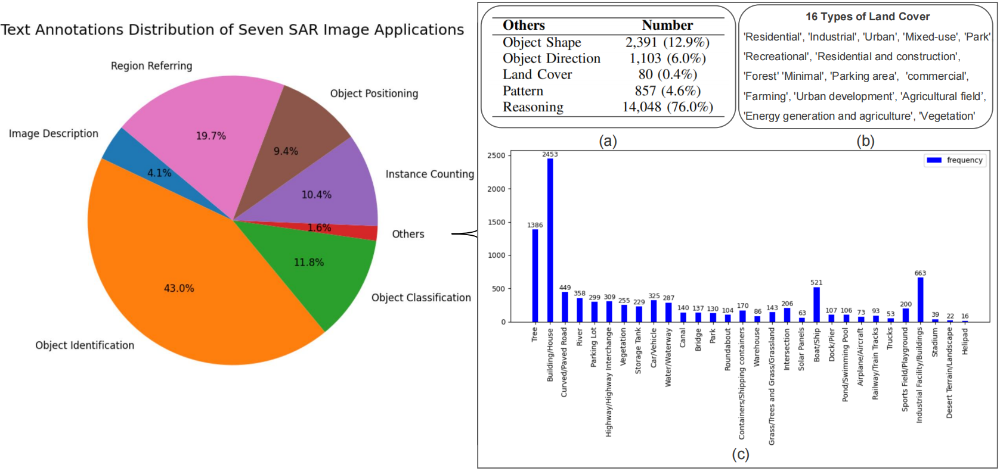

<div align="center">
<h1 align="center">☀️SARLANG-1M☀️</h1>

<h3>SARLANG-1M: A Benchmark for Vision-Language Modeling in SAR Image Understanding</h3>

[Yimin Wei](https://www.researchgate.net/profile/Yimin-Wei-9)<sup>1,2</sup>, [Aoran Xiao](https://scholar.google.com/citations?hl=ja&user=yGKsEpAAAAAJ)<sup>2</sup>, [Yexian Ren](https://scholar.google.com/citations?user=xX1c-SwAAAAJ&hl=en)<sup>3</sup>, [Yuting Zhu](https://scholar.google.com/citations?user=2G9RsM0AAAAJ&hl=zh-CN)<sup>4</sup>,  
[Hongruixuan Chen](https://scholar.google.ch/citations?user=XOk4Cf0AAAAJ&hl=zh-CN&oi=ao)<sup>1,2</sup>, [Junshi Xia](https://scholar.google.com/citations?user=n1aKdTkAAAAJ&hl=en)<sup>2</sup>, [Naoto Yokoya](https://scholar.google.co.jp/citations?user=DJ2KOn8AAAAJ&hl=en)<sup>1,2 *</sup>

<sup>1</sup> The University of Tokyo, <sup>2</sup> RIKEN AIP,  <sup>3</sup> Nanjing University of Information Science and Technology,  <sup>4</sup> Sun Yat-sen University

[](https://arxiv.org/abs/2504.03254)   [](https://huggingface.co/datasets/YiminJimmy/SARLANG-1M)

</div>

## 🛎️News
* **` Notice☀️☀️`**: The [full version of the SARLANG-1M paper](https://arxiv.org/abs/2504.03254) are now online. Related data and benchmark suites will be released soon!!
* **` Apr 27th, 2025`**: SARLANG-1M was presented at the [3rd Workshop on Machine Learning for Remote Sensing (ML4RS)](https://ml-for-rs.github.io/iclr2025/) at ICLR 2025. See the [demo](https://docs.google.com/presentation/d/1m4ejHd3-JMEAkstrhNPho9hp26MVoZqcQRvKCf9mGFc/edit#slide=id.g35074c149df_0_148)!!
* **` Apr 7th, 2025`**: The [arXiv paper](https://arxiv.org/abs/2504.03254) of SARLANG-1M is now online. If you are interested in details of SARLANG-1M, do not hesitate to take a look!!

## 🔭Overview

* [**SARLANG-1M**](https://arxiv.org/abs/2504.03254) is a large-scale benchmark tailored for multimodal SAR image understanding, with a primary focus on integrating SAR with textual modality. SARLANG-1M comprises more than 1 million high-quality SAR image-text pairs collected from over 59 cities worldwide. It features hierarchical resolutions (ranging from 0.1 to 25 meters), fine-grained semantic descriptions (including both concise and detailed captions), diverse remote sensing categories (1,696 object types and 16 land cover classes), and multi-task question-answering pairs spanning seven applications and 1,012 question types. Fine-tuning with our SARLANG-1M dataset can significantly enhance VLMs' performance in SAR image interpretation, reaching performance comparable to human experts.

<p align="center">
  
</p>

* [**SARLANG-1M**](https://arxiv.org/abs/2504.03254) dataset supports seven SAR applications:

| Application | Application Description | Text Numuber |
|:---:|:---:|:---:|
| Image Description | Describe the SAR image | 45,650 |
| Object Identification | Determine the presence of specific objects | 484,620 |
| Object Classification | Identify the predominant category within the SAR image | 132,525 |
| Instance Counting | Quantify instances within the SAR image | 117,382 |
| Region Referring | Determine the category present in the specific location | 221,450 |
| Object Positioning | Determines the approximate location of a category | 106,171 |
| Others | Predict the object shape, direction, reasoning etc | 18,479 |

* The Statistics of Text Annotations in SARLANG-1M dataset: 
<p align="center">
  
</p>

The image shows the distribution of seven applications provided in the SARLANG-1M benchmark (a), the numbers of each question type in the 'others' application (b), and the distribution of the 30 most frequent object categories (c).

## 🗝️Let's Get Started with SARLANG-1M!
### `A. Installation`

Note that the code in this repo runs under **Linux** system. We have not tested whether it works under other OS.

**Step 1: Clone the repository:**

Clone this repository and navigate to the project directory:
```bash
git clone https://github.com/Jimmyxichen/SARLANG-1M.git
cd SARLANG-1M
```

**Step 2: Environment Setup:**

It is recommended to set up a conda environment and installing dependencies via pip. Use the following commands to set up your environment:

***Create and activate a new conda environment***

```bash
conda create -n SARLANG1M
conda activate SARLANG1M
```

***Install dependencies***

```bash
pip install -r requirements.txt
```

### `B. Data Preparation`

Please download the SAR images from [HuggingFace](https://huggingface.co/datasets/YiminJimmy/SARLANG-1M) and make them have the following folder/file structure:
```
${DATASET_ROOT}   # Dataset root directory, for example: /home/username/data/SARLANG_1M
│
├── SARimages
│    ├── France_Alpes-Maritimes_Nice_3.png
│    ├── SV_Darwin_-12.4278_130.8688.png
│    ├── 0009787.jpg  # Add all SAR images in the SARDet_100K dataset to this folder
│         ...   
│   
└── Text
     ├── caption
     │
     └── VQA
         ...
```
Both the original SAR images [tif format] and preprocessed SAR images [png format] are provided. Notably, SAR image preprocessing is an optional strategy to improve the performance of VLMs by significantly enhancing image clarity and effectively highlighting key objects within the SAR images. You can choose any version according to your needs.

Our text data is available in the Text.zip file, which can be accessed via [HuggingFace](https://huggingface.co/datasets/YiminJimmy/SARLANG-1M/blob/main/Text.zip). We provide the text data in both JSON and CSV formats, allowing users to select the appropriate format based on their specific requirements.


***Caption Labels***


The dataset includes two types of captions: complex captions and concise captions. Mixed captions, which combine both complex and concise descriptions, are used for training and are stored in the Caption-training.csv file. For evaluation, Caption_test.csv contains only complex captions as the test set, while Caption_test1.csv contains only concise captions as the test set.


***VQA Labels***


We partition the VQA data in our dataset into two subsets: SARVQA1_train/test and SARVQA2_train/test. The files prefixed with SARVQA1_train/test contain VQA text annotations for SAR images sourced from the [SARDet_100K](https://github.com/zcablii/SARDet_100K) dataset. These annotations are generated based on bounding box information, providing highly accurate descriptions of both the location and quantity of objects. However, the [SARDet_100K](https://github.com/zcablii/SARDet_100K) dataset only includes six common categories of remote sensing targets, which limits the diversity of object types represented in these annotations.

In contrast, the files prefixed with SARVQA2_train/test contain VQA textual annotations for SAR images derived from the [SpaceNet6](https://spacenet.ai/sn6-challenge/), [DFC2023](https://www.grss-ieee.org/community/technical-committees/2023-ieee-grss-data-fusion-contest/) and [OpenEarthMap-SAR](https://zenodo.org/records/14622048) datasets. These datasets offer high-resolution SAR imagery, with ground sampling distances ranging from 0.1 to 1 meter, and encompass a richer variety of remote sensing target categories. If your research primarily focuses on high-resolution SAR image interpretation, you may opt to use only this subset for model training.

Note: If you intend to train your model on the combined VQA data from both subsets, it is necessary to prepend prompts such as “The classes are: tank, car, aircraft, harbor, bridge, ship.” or "The classes are: top, center, bottom, left, right." to the questions originating from the [SARDet_100K](https://github.com/zcablii/SARDet_100K) dataset to clarify the available object/position categories.


### `C. Model Training & Tuning`

### `D. Inference & Evaluation`

## 📜Reference

If this dataset or code contributes to your research, please kindly consider citing our paper and give this repo ⭐️.

## 🤝Acknowledgments
The authors would also like to give special thanks to [SARDet_100K](https://github.com/zcablii/SARDet_100K), [SpaceNet6](https://spacenet.ai/sn6-challenge/), [DFC2023](https://www.grss-ieee.org/community/technical-committees/2023-ieee-grss-data-fusion-contest/) and [OpenEarthMap-SAR](https://zenodo.org/records/14622048) for providing the valuable SAR Images.

## 🙋Q & A
***For any questions, please feel free to leave it in the [issue section](https://github.com/Jimmyxichen/SARLANG-1M/issues) or [contact us.](2364356729@qq.com)***

## Limitation
To construct the dataset and ensure high-quality textual annotations, we engaged several SAR experts who dedicated substantial time and effort to meticulously review and correct the text data. Through this process of manual verification, the quality of the annotations has been significantly improved compared to those originally generated by models such as GPT-4o. Nevertheless, it is inevitable that a small proportion of the text may still contain inaccuracies. We welcome feedback regarding any erroneous annotations and are committed to continuously updating and refining the dataset. We hope that our dataset will be a valuable resource for your research.
